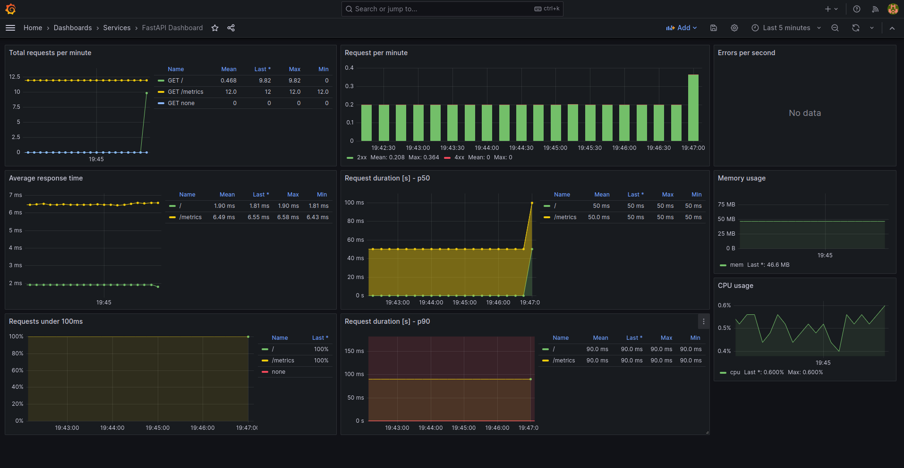

<h1 align="center">FastAPI + Prometheus + Grafana :tada:</h1>

This is a minimal setup that you can build to monitor your FastAPI microservice.

## Installation

There are only two prerequisites:

* [Docker](https://docs.docker.com/get-docker/)
* [Docker-compose](https://docs.docker.com/compose/install/)

Having both, you'll need to clone the repository:

``` bash
git clone https://github.com/Kludex/fastapi-prometheus-grafana
```

## Usage

You'll need to run the docker containers:

``` bash
docker-compose up
```

Now you have access to those three containers and their respective ports:

* Prometheus: http://localhost:9090/
* Grafana: http://localhost:3000/
* FastAPI: http://localhost:8000/

On the FastAPI, you can access `/metrics` endpoint to see the data Prometheus is scraping from it.

## How it looks like

<p align="center">
  
</p>

## References

* [Prometheus FastAPI Instrumentator](https://github.com/trallnag/prometheus-fastapi-instrumentator)
* [Generate and Track Metrics for Flask API Applications Using Prometheus and Grafana](https://medium.com/swlh/generate-and-track-metrics-for-flask-api-applications-using-prometheus-and-grafana-55ddd39866f0)
* [PromQL for Humans](https://timber.io/blog/promql-for-humans/)
